

# Communication Lab

Steven Shao, 27/01/2023

* [Lab 1 Exercise 1](#lab1e1)
* [Lab 1 Exercise 2](#lab1e2)
* [Lab 1 Exercise 3](#lab1e3)
* [Lab 2 Exercise 1（Rectifier）](#lab2e1)
* [Lab 2 Exercise 2](#lab2e2)
* [Lab 2 Exercise 3](#lab2e3)
* [Lab 2 Exercise 4](#lab2e4)
* [Lab 3 Exercise 1](#lab3e1)
* [Lab 3 Exercise 2](#lab3e2)
* [Lab 3 Exercise 3](#lab3e3)
* [Lab 3 Exercise 4](#lab3e4)
* [Lab 3 Exercise 5](#lab3e5)
* [Lab 4 Exercise 1](#lab4e1)
* [Lab 4 Exercise 2](#lab4e2)
* [Lab 4 Exercise 3](#lab4e3)
* [Lab 4 Exercise 4](#lab4e4)

# Lab 1
## Lab 1 Exercise 1

This is the result of "HOT NAME" by inputting my full name into the system. My name is a "COLD Name" 

I also try to figure the HOTNAME output from this system. __It seems like only if the name containing all "Z" will output HOT.__ 

### [Lab 1 Exercise 2](#top)

__Question 1:__ Include the block diagram and the front panel in your logbook.  

.png)
.png)

__Question 2:__ Create a control for stopping the execution of the program after 1000 iterations. Set the value of “number of bins” to 10. Include the corresponding histogram in your logbook.  
.png)

Here I add an Equal logic to compare "I" value with 1000 to be the end condition. 

.png)

The output from this system have a normal distribution with mean of 5 and a small standard deviation. In the next task, we are going to change it into standard normal distribution. 
 
__Question 3:__ Revise your code such that the final distribution you observe in the histogram is a standard Normal distribution (i.e., it has zero mean and unit variance). Include the revised block diagram in your logbook, and explain each of the changes you have made. 

.png)

Inside LABVIEW, there is a "statistic block" under the diagram tab. This block can output the value of expectation, variance, and standard deviation of a signal based on the input signal. The equation of transforming a normal distribution into a standard normal one is by subtracting expectation and divide by the standard deviation. Therefore, I connect the output signal from the Add Array Elements function into the Statistic Block, do the operation, and feed the signal back into the Histogram Function. The output below is indeed a standard normal distribution. 

.png)

 ### [LAB 1 Exercise 3](#top)

In this exercise, we are going to build an AM modulator and graph the output of the modulated signals. The equation for modulating a single tone signal is given by: 
 
$$
s(t)=\left[A_c+A_m \cos \left(2 \pi f_m t\right)\right] \cos \left(2 \pi f_c t\right)
$$

__Question 1:__ Adjust plots using graph tools and show the block diagram: 

.png)

As shown in the diagram above, the two graphs in the first row represent the message signal with a frequency of 1000Hz and the frequency diagram that shows the message signal's frequency.  

The graphs in the second row show the modulated signals (carrier and message signal) and the frequency diagram of the modulated signal. 

This is the block diagram of how we design it. 

 

>Notice: What is a PSD block? 

>A Power Spectral Density (PSD) is the measure of signal's power content versus frequency. A PSD is typically used to characterize broadband random signals. PSD is a tool similar to Fast Fourier Transform (FTT). The PSD and FFT are both tools for measuring and analyzing a signal's frequency content. The FFT transfers time data to the frequency domain, which allows engineers to view changes in frequency values. The PSD takes another step and calculates the power, or strength, of the frequency content. 

__Question 2:__ Set 𝐴𝑐 = 2 and change 𝐴𝑚 in the panel window to obtain the modulation index values 𝜇 = {0.5,1, 1.5}. For each value of 𝜇 plot the time domain and PSD representations of both the message and modulated signals. What is the impact of the modulation index on the modulated signal? Explain your answer. 
 

Modulation index (μ) = 0.5 

The signal is under-modulated signal. This can create the original cosine signal with the right frequency. 

Modulation index (μ) = 1 

The signal is a perfect-modulated signal. The modulated signal perfectly represents a cosine signal with frequency of 1kHz. 

Modulation index (μ) = 1.5 

The signal is an over-modulated signal, where the signal is distorted and can no longer represent the original cosine signal. 

### __*Background Information:*__

The modulation index is often denoted in percentage called as Percentage of Modulation. We will get the percentage of modulation, just by multiplying the modulation index value with 100. For a perfect modulation, the value of modulation index should be 1, which implies the percentage of modulation should be 100%. 

For instance, if this value is less than 1, i.e., the modulation index is 0.5, then the modulated output would look like the following figure. It is called as Under-modulation. Such a wave is called as an under-modulated wave. 

If the value of the modulation index is greater than 1, i.e., 1.5 or so, then the wave will be an over-modulated wave. It would look like the following figure. 

.jpeg)

Over-Modulated signals are undesirable, because the modulated signals got distorted. The carrier signal experiences a 180 degree phase reversal, which causes additional sidebands. The resulting demodulated signal can no longer represents the original signal. 

__Question 3:__ Set 𝐴𝑐 = 1 and 𝐴𝑚 = 1. Change the frequency of the message signal to 𝑓𝑚 = {1𝑘, 2𝑘, 5𝑘}. What is the impact of the varying frequency value on the modulated signal? Explain your answer.  

.png)

fm = 1k 

.png)

fm = 2k 

.png)

fm = 5k 

The varying message frequency changes the modulated signal's frequency graph. The cosine wave's frequency modulation graph is creating to spikes around the carrier frequency (plus or minus the message frequency). When frequency increases, the separation between the spikes increases. In addition, envelope signal has larger frequency !!!

 
In the last step, we created a sub-VI for this design, similar to a sub-module. 

.png)

# Lab 2 AM Simulation and USRP

### [Lab 2 Exercise 1](#top)
In this task, we are going to demodulate the amplitude modulated signal using two method. 

1. Coherent demodulation: multiply AM signal with carrier signal and apply a low pass filter.
2. Envelope Detection: Rectify AM signal, low pass filtered, and remove DC component.

#### Exercise 1a (Coherent):
This is the block diagram of the model:

* In the diagram, we can remove the DC component by applying `Amplitude Measurements` module. We can input the signal, and the module can output the DC value. Remeber to use `single shot` mode.
* `Filter` module can create a low pass filter

The original signal is given by:

$$
s(t)=\left[A_c+A_m \cos \left(2 \pi f_m t\right)\right] \cos \left(2 \pi f_c t\right)
$$

By multiplying the carrier signal and applying a low pass filter, we can get the following result:

The output from the low pass filter is a combination of a DC value and the message signal, so we have to minus the DC value to recover the true message signal. Setting Ac = 2 to adjust the constant.

#### Exercise 1b (Envelope):
Block Diagram:

* Multiplication of $\Pi$ is used to amplify the signal and compensate the loss from rectification.

> Rectifier does not have a simple impulse response, a diode that performs  rectification is a non-linear component and thus does not have a linear impulse response. But when we rectify a periodic signal, its impulse response looks like a square wave with same period T. (All negative value = 0). The convolution of cosine message signal with square wave has the following frequency response. At low frequecny, amplutude = 1/π with A = 1/2, so a multiplication of π is needed before rectification.

* `Waveform Properties` and `Build Waveform` are dual blocks. The first one decompose a waveform into complex array, while the second one reconstruct the wave from from data array. In this design, we decompose the signal, set negative values to zero, and reconstruct to achieve rectification.

__*How Envelope Detection works:*__

The diode detector acts like a rectifier that cuts of any negative compenent. The red line is the envelope, which in this case is the message signal. After passing through the low pass filter and minus the DC value, the only thing remaining is the red line (message signal) centered around DC.

### [Lab 2 Exercise 2: AM Simulation](#top)
Block diagram:

After setting the variables to the correct value and changing the message signal amplitude from 1 to 4, we observed that the coherent method is receiving the exact same signal while the envelop detection method failed to function after message amplitude is greater than 2. Instead, the second method received distorted signal.

Message amplitude = 1:

Message amplitude = 2:

Message amplitude = 3:

Message amplitude = 4:

This distortion comes from the mathematical logic behind the method. Remember, the AM signal has the equation:

$$
s(t)=\left[A_c+A_m \cos \left(2 \pi f_m t\right)\right] \cos \left(2 \pi f_c t\right)
$$

The envelope detection line received the signal `Ac + Amcos(2pifmt)`. If Ac > Am/under modulation, the system is fine, becuase all the message signal is fully on the upper half plane. 

However, if Ac < Am / overmodulated, the amplitude of the carrier is already fliped, so we cannot recover the original message signal

### [Lab2 Exercise 3](#top)
niUSRP is a communication module that can send and receive signals.
Several components explanation:

Transimitter side:

Recevier side:

#### Task 2:
Transmit a single-tone message signal with frequency 5kHz and modulation index 1:

The signal is perfectlly received at the receiver side, with PSD showing a high peak at 5000 HZ.

#### Task 3: Observing noise:
Gain at receiver end is set to 20dB.

Modulation index = 0.8:

Modulation index = 0.7:

Modulation index = 0.6:

Modulation index = 0.5:

At this modulation index, noises started to appear on both frequency and time domain.

### [Lab2 Exercise 4: Listerning to AM Music](#top)
When running `USRP_AM_Rx_Music.gvi`, the music is received after around 1 minutes, because IQ rate is 100k, very high.

> Not sure why IQ rate/sampling frequency affect time of receiving signal

> video: music recorded

# Lab 3
### [Lab3 Exercise 1 FM Modulator](#top)
In this section, we were trying to build a FM modulator from the equation given. In the FM_Modulator.gvi, we used the block `Waveform Properties` to breaks up the continuous signal into arrays of data, `Integral x(t)` to make a integral of the signal, `Sine and Cosine` to take the sine and cosine values of the data, and `Build waveform` to reconstruct a continuous signal. 

$$\theta_m(t)=2 \pi \mathbf{k}_f \int_0^t m(\tau) \mathbf{d} \tau$$
$$s(t)=A_c \cos \left(2 \pi f_c t\right) \cos \left(\theta_m(t)\right)-A_c \sin \left(2 \pi f_c t\right) \sin \left(\theta_m(t)\right)$$
$$
s(t)=A_c \cos \left(2 \pi f_c t+\theta_m(t)\right)
$$

Here is our block diagram:

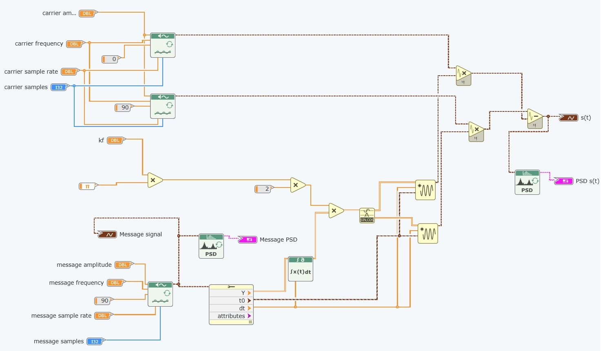

When kf increases, the frequency deviation △f also increases as △f = kf * mf, where mf is the peak of the message signal, resulting a higher modulation index(μ). In frequency modulation (FM), the modulation index is defined as the ratio of the frequency deviation of the carrier signal to the frequency of the modulating signal. A higher modulation index in FM results in a larger variation in the frequency of the carrier signal and a wider bandwidth of the modulated signal. Thus, as we can see from the modulated PSD, the spectrum spread over a larger frequency range as kf increases.

kf = 500

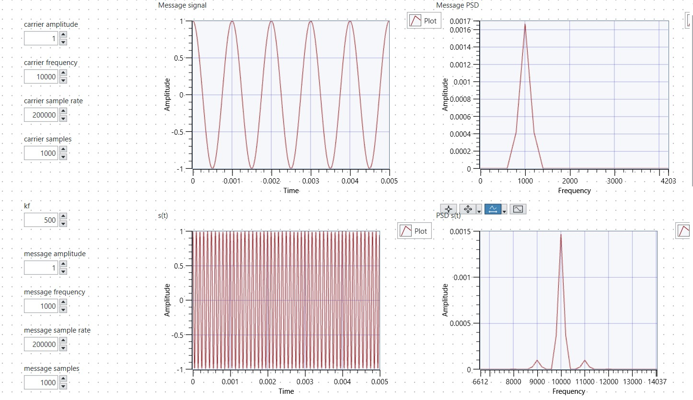

kf = 2000

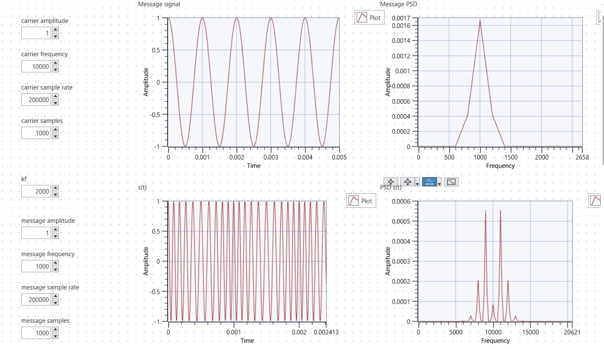

kf = 5000

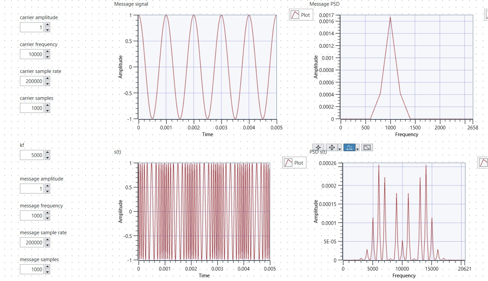

### [Lab3 Exercise 2: FM Demodulator](#top)
One way of demodulating the FM signal is by differentiating the FM signal. The output is an AM+FM signal. Then, demodulate the AM+FM signal using envelope detector to extract the message signal incoporate inside the amplitude. The mathematical model behind this is shown below:

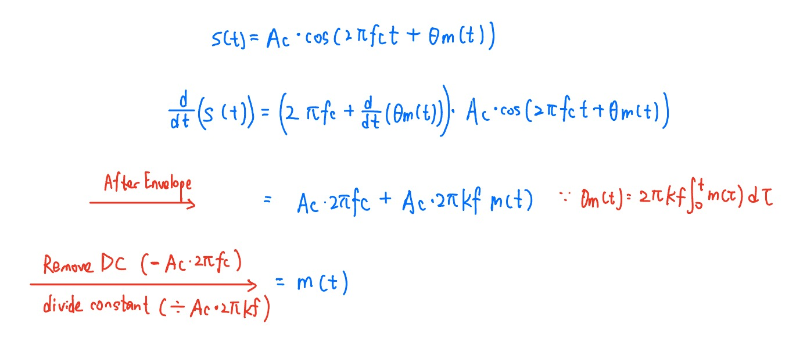

Remember from Lab 2, there is a rectification loss of π, so in the block diagram, we only divide 2kf instead of 2kfπ.

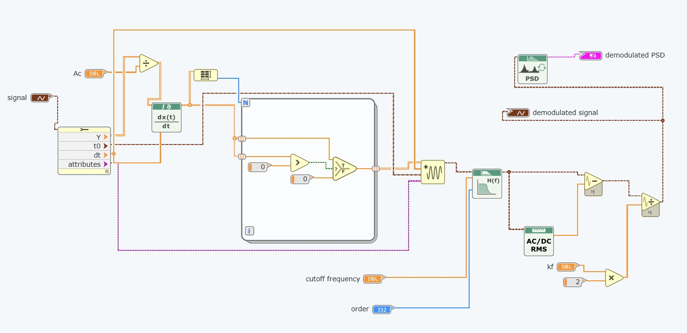

### [Lab3 Exercise 3: FM Simulation](#top)
By adding the two previous subVIs together and connecting properly, we can then do FM Simulation. Using the given values, we recover the proper message signal with a amplitude of 2 and frequenct of 1000Hz.

> block diagram

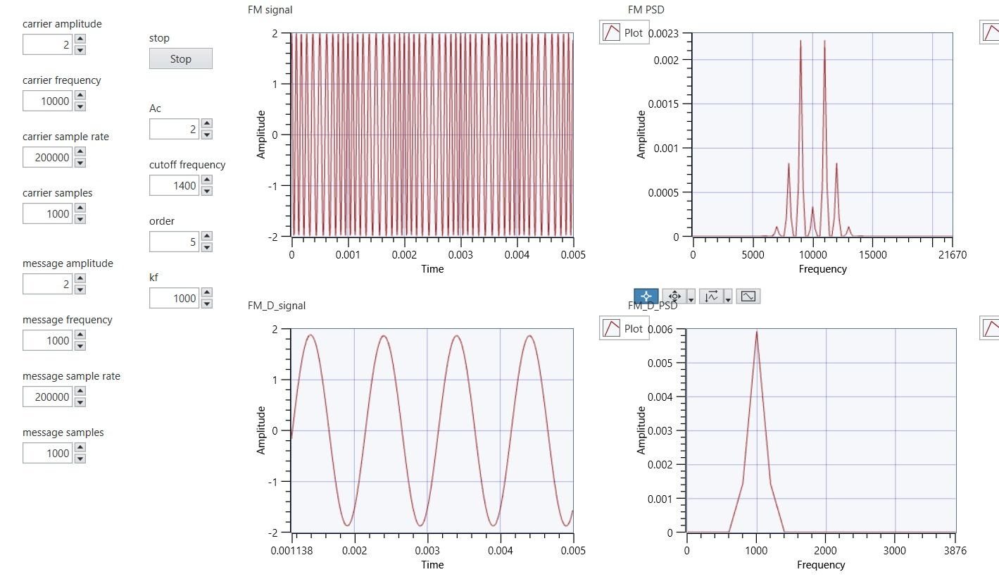

### [Lab3 Exercise 4: FM communications via USRP](#top)
Using the given code, we are able to receive FM signal via USRP. 

Carson's rule:  
$$B_{F M} \cong 2(\Delta f+B)$$

Message signal is a single tone signal with frequency centered at 1000 Hz and bandwidth around 20 Hz.

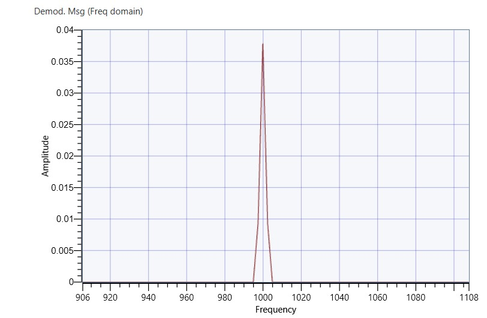

Frequency deviation (△f) = 1 kHz:

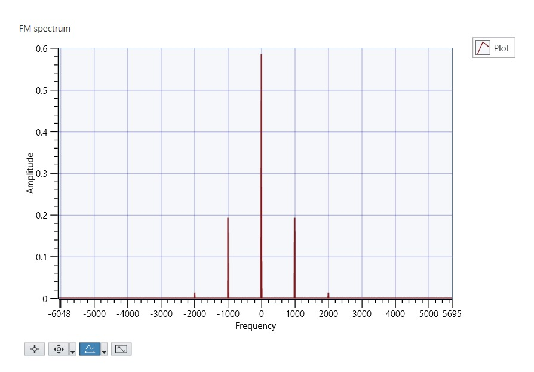

$$B_{F M} \cong 2(\Delta f+B) = 2(1k + 20) = 2040 Hz$$

Frequency deviation (△f) = 5 kHz:

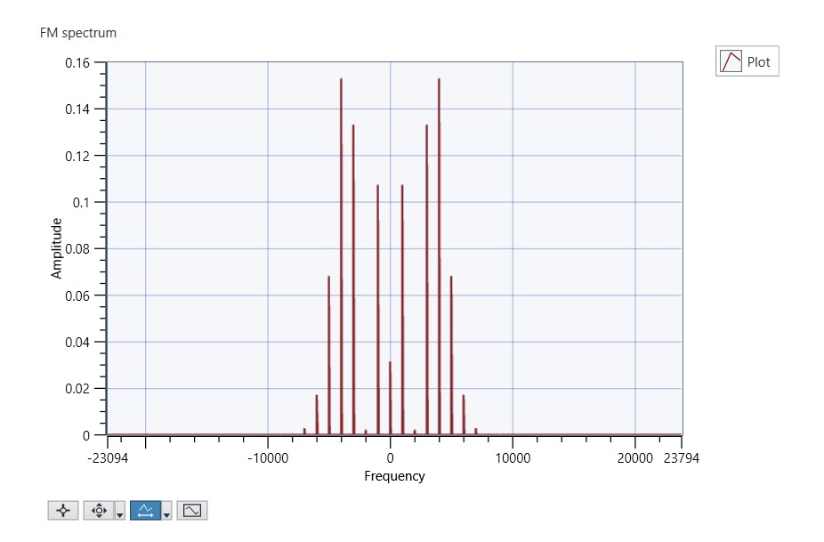

$$B_{F M} \cong 2(\Delta f+B) = 2(5k + 20) = 10040 Hz$$

Frequency deviation (△f) = 30 kHz:

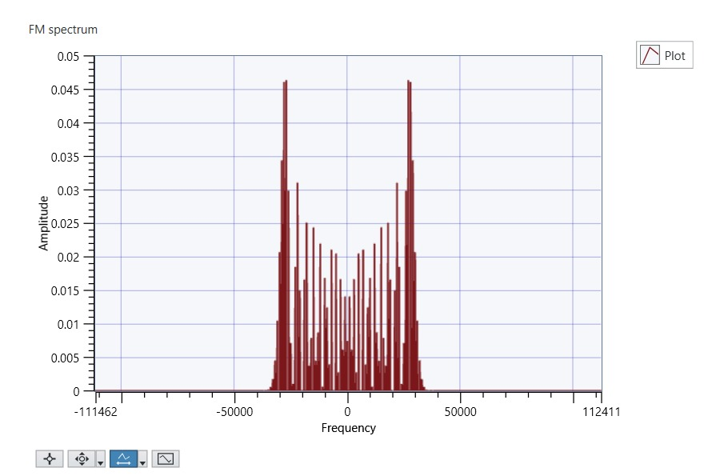

$$B_{F M} \cong 2(\Delta f+B) = 2(30k + 20) = 60040 Hz$$

### [Lab3 Exercise 5: Listening to FM Radio using USRP](#top)
Using the given VI `Find Radio Station.gvi` and setting the carrier frequency to 90M and the IQ rate to 20M, the system search the radio signal amplitde with a graph centered at 0 (90MHz) and bandwidth is 20MHz (+/-10MHz). I found that 83.4MHz has the strongest signal at that time.

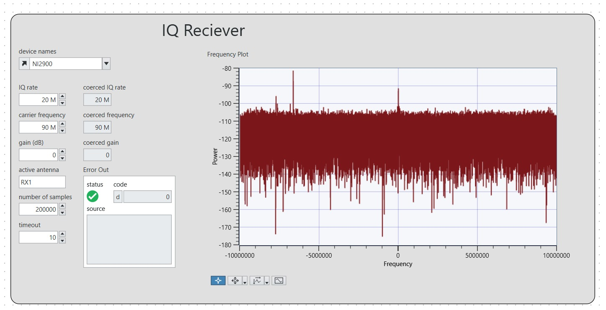

Then, using `FM Music.gvi`, we were able to listen to the radio at the specfic frequency by setting the gain to 3000(amplify the signal). Tried: BBC1 - 98.8MHz.

> Video is recorded

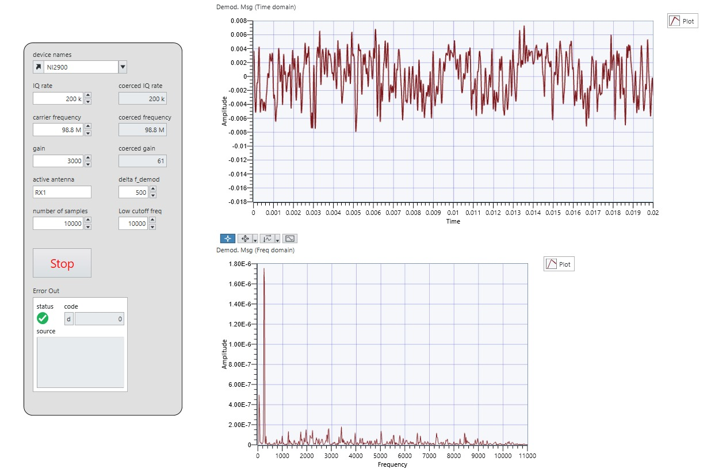

# Lab 4

### [Lab 4 Exercise 1 BPSK Transmitter](#top)

The BPSK signal is given by:

$$
A g_{T X}(t) \cos \left(2 \pi f_c t+\theta(t)\right)
$$

where $\theta(t)$ takes the value of either 0 or 180 degree to carry the desired informtaion, so the equation is as follows:

$$
\pm A g_{T X}(t) \cos \left(2 \pi f_c t\right)
$$

The step needed to form a BPSK signal:

* symbol mapping: 

$$
\begin{array}{|l|l|l|}
\hline \text { Bit Value } & \text { Phase }(\theta) & \text { Symbol } \\
\hline 0 & 0 & -1 \\
\hline 1 & 180 & +1 \\
\hline
\end{array}
$$

* upsampling: In the context of BPSK, upsampling is used to increase the data rate of the transmitted signal. This is typically done by inserting additional zeros between the original data bits, which effectively increases the symbol rate of the signal. __Increase data transmission rate without requiring additional bandwidth.__ 

$$
After sampling:\frac{1}{T_x}=L \frac{1}{T}(sample rate)
$$

$$ L = \frac{IQ rate}{symbol rate} $$

* Pulse Shaping: Use root-raised cosine, pulse shape has a very rapid spectral roll-off, so that consecutive transmitted symbols do not interfere with each other. __avoid inter-symbol interference__

Given IQ rate is 200kHz, symbol rate is 10000 symbols/s, L is 20.

Here is the block diagram and front pannel.

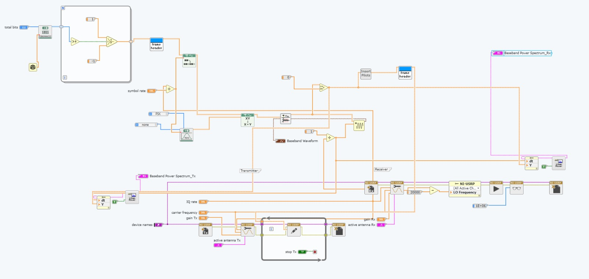

>Front pannel

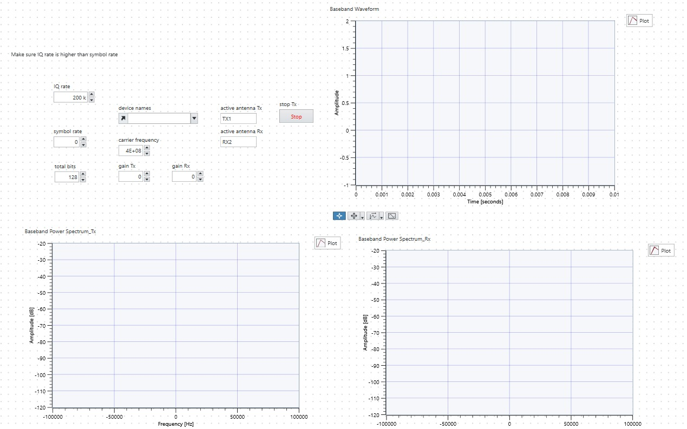

We noticed that there are already some pannels showing both transmitted signals and recevied basedband signal built inside the block.

Root-Raised-Cosine:

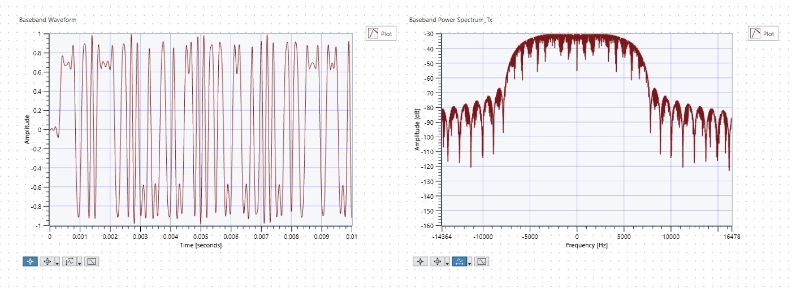

Main lobe bandwidth: 7500Hz

No Shape:

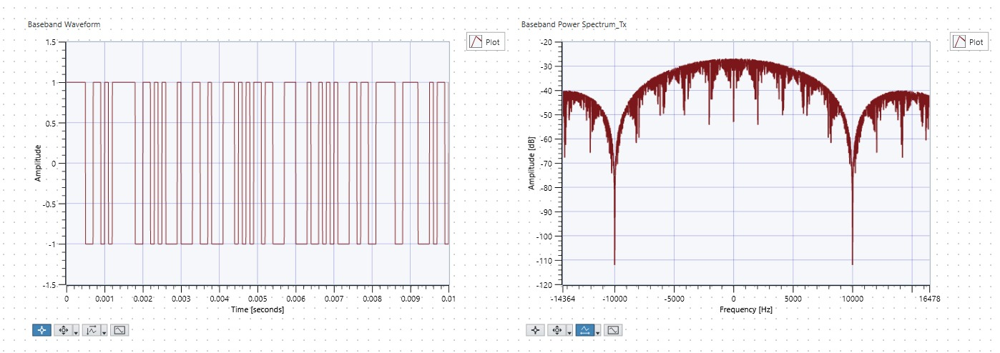

Main lobe bandwidth: 10000Hz

The main lobe bandwidth is smaller for root-raised-cosine, and the spectral roll-off is greater. __To avoid interference__

#### What is interference between symbols
***In digital communication systems, inter-symbol interference (ISI) occurs when the transmitted symbols interfere with each other due to the limited bandwidth of the communication channel. This happens because a signal that is transmitted through a channel occupies a certain amount of frequency bandwidth in that channel.***

***When the bandwidth of the transmitted signal exceeds the available bandwidth of the channel, the signal starts to interfere with adjacent frequency bands, causing distortion and interference. This interference can cause the symbols to become blurred and overlap with each other, which leads to ISI.***

### [Lab 4 Exercise 2 BPSK Receiver](#top)

The BPSK signal arrived at the receiver end is：

$$
r(t)= \pm D g_{T X}(t) \cos \left(2 \pi f_c t+\varphi\right)
$$

The angle $\varphi$ represents the difference in phase between the transmitter and receiver carrier oscillators.

The steps needed to obtain the transmitted signals are:

* Channel estimation: To remove the phase offset between transmitter and receivers oscillators. On the transmitter side, a pilot signal is sent. The channel estimation stage receive the signal, and performing least-square channel estimation to find the channels transfer function, reverse it then applied to the received signal.

* Matched filtering: applied same root-rasied cosine filter, maximize SNR. The output is the analogue baseband signal that must be sampled once per symbol rate.

* Pulse Synchronization: use Pulse Align to align baseband signal

* Sampling: Sampling at symbol rate

* Detection and Symbol mapping, detect -1 or 1 and transformed to 0 or 1.

By running the transmitter and receiver several time at gain 0dB, we noticed that **the BER is always 0**, indicating that all signals are recieved properly.

The BER module given is the lab is not working properly. I created my own BER module:

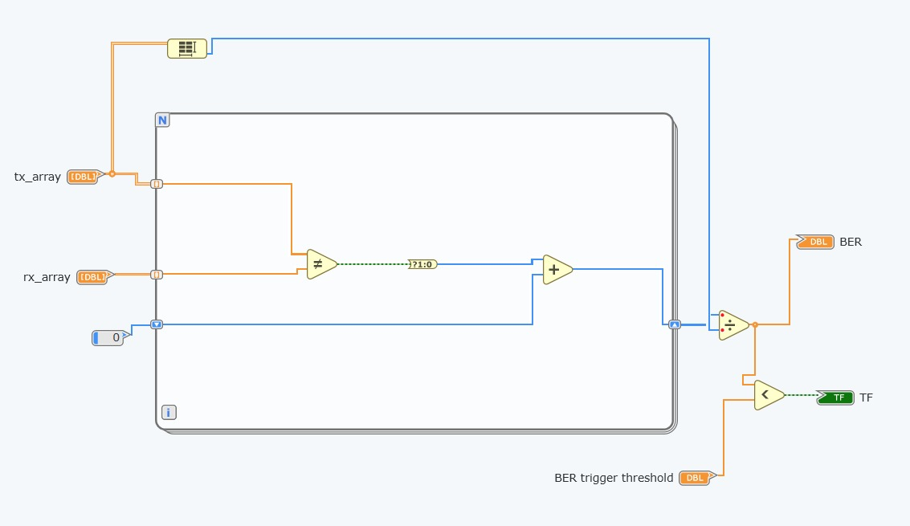

BER at different gain:

$$
\begin{array}{|c|c|c|c|c|c|c|c|}
\hline \text { Tx G } & \text { Rx G } & \text {  1 } & \text {  2 } & \text { 3 } & \text {  4 } & \text {  5 } & \text { BER Aver. } \\
\hline 0 & 0 & 0 & 0 & 0 & 0 & 0 & 0 \\
\hline-35 & -15 & 0.226 & 0.213 & 0.283 & 0.227 & 0.212 & 0.2322 \\
\hline-37 & -15 & 0.256 & 0.316 & 0.252 & 0.253 & 0.253 & 0.266 \\
\hline-40 & -15 & 0.36 & 0.363 & 0.355 & 0.389 & 0.359 & 0.3652 \\
\hline
\end{array}
$$

It makes sense, as the gain decreases, it is harder for receiver to recover the transmitted signals.

### [Lab 4 Exercise 3 DPSK](#top)
DPSK is similar to BPSK,but in stead of transmitting the signal itself, it sends the difference between to adjacent bits.

Encoder: $b_n=b_{n-1} \times a_n$, where $a_n$ is the information symbol. 

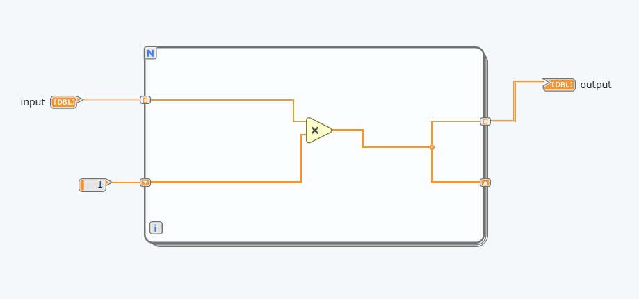

Decoder: Received data are complex valued, decoder is the product of the current sample and the complex conjugate of the previous sample.

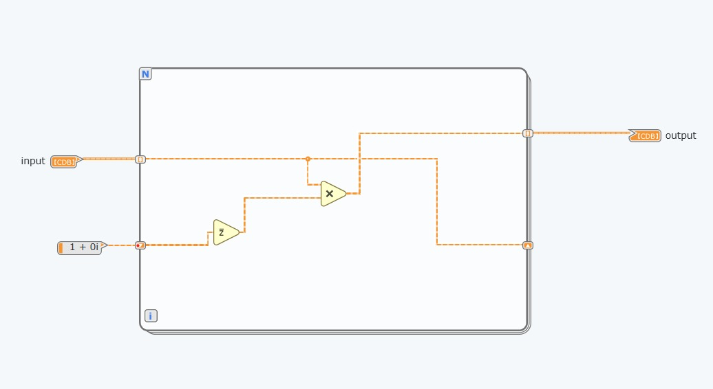

BER of DPSK at different gain:

$$
\begin{array}{|c|c|c|c|c|c|c|c|}
\hline \text { Tx G } & \text { Rx G } & \text {  1 } & \text {  2 } & \text {  3 } & \text {  4 } & \text {  5 } & \text { BER Aver. } \\
\hline 0 & 0 & 0 & 0 & 0 & 0 & 0 & 0 \\
\hline-35 & -15 & 0.314 & 0.31 & 0.346 & 0.323 & 0.284 & 0.3154 \\
\hline-37 & -15 & 0.382 & 0.356 & 0.36 & 0.373 & 0.358 & 0.3658 \\
\hline-40 & -15 & 0.437 & 0.413 & 0.405 & 0.415 & 0.412 & 0.4164 \\
\hline
\end{array}
$$

We noticed that at low gain senerio, BPSK is better than DPSK with lower BER. 

***This is because in BPSK, the transmitted signal is a simple phase shift of either 0 or 180 degrees, while in DPSK, the transmitted signal is a phase shift relative to the previous symbol. When the SNR is low, the noise in the channel can cause errors in the phase of the DPSK signal, leading to errors in decoding the transmitted data. In contrast, with BPSK, the receiver only needs to compare the phase of the received signal to a fixed reference, which can be done more accurately even in noisy conditions.***

### [Lab 4 Exercise 4 Error Correction Coding](#top)
Forward error correction（FEC）is performed by adding redundancy to the transmitted information. The transmitter send each data bit 3 times (triplet). The receiver might receive 8 versions of triplets and decode based on majority vote.

FEC encoder: send data three time

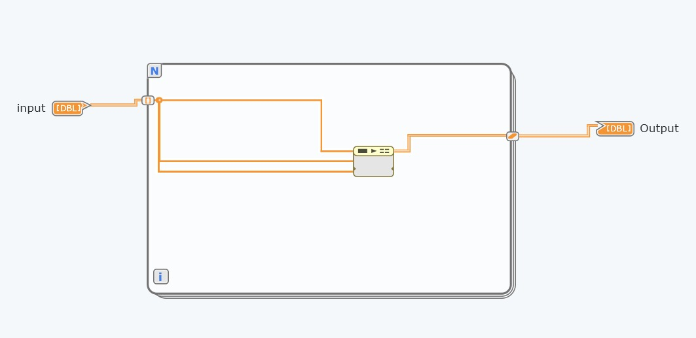

Validation:

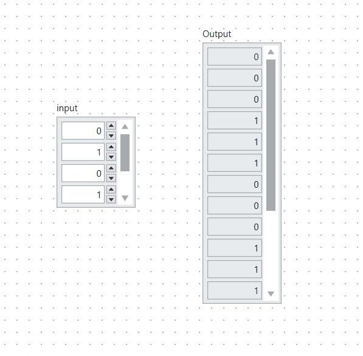

FEC decoder: decode based on the following principle:

$$
\begin{array}{|c|c|}
\hline \text { Triplet received } & \text { Bit decoded } \\
\hline 000 & 0 \\
\hline 001 & 0 \\
\hline 010 & 0 \\
\hline 011 & 1 \\
\hline 100 & 0 \\
\hline 101 & 1 \\
\hline 110 & 1 \\
\hline 111 & 1 \\
\hline
\end{array}
$$

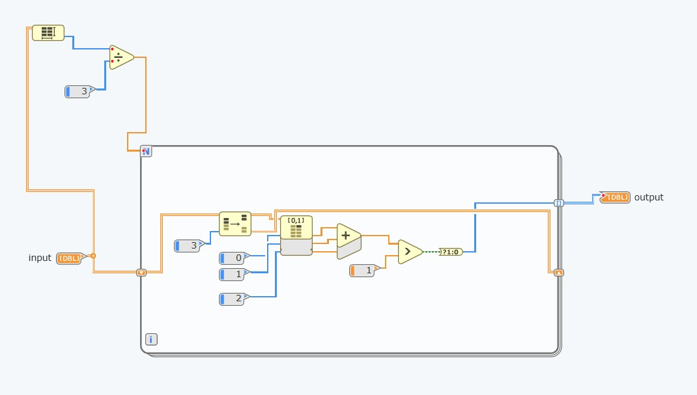

Validation:

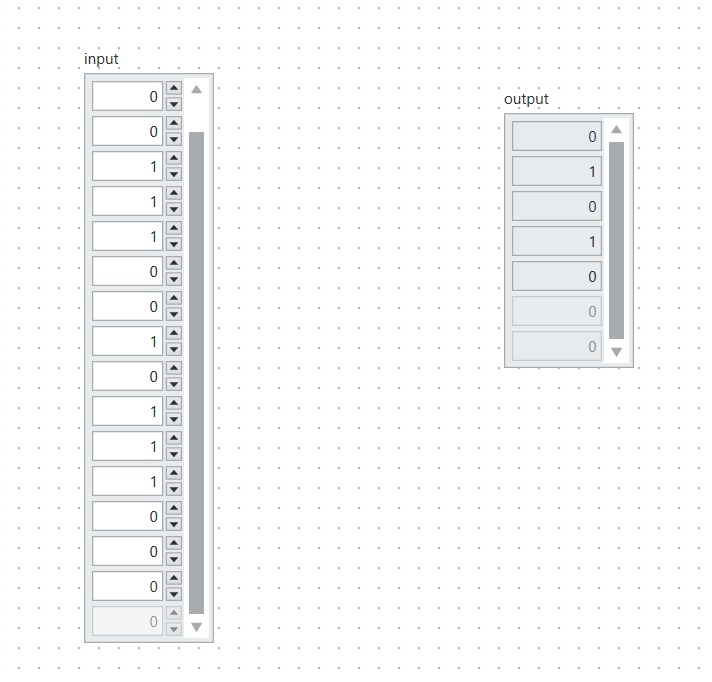

BER of using FEC:

$$
\begin{array}{|c|c|c|c|c|c|c|c|}
\hline \text { Tx G } & \text { Rx G } & 1 & 2 & 3 & 4 & 5 & \text { BER Aver. } \\
\hline 0 & 0 & 0 & 0 & 0 & 0 & 0 & 0 \\
\hline-35 & -15 & 0.14 & 0.167 & 0.177 & 0.149 & 0.159 & 0.1584 \\
\hline-37 & -15 & 0.223 & 0.232 & 0.188 & 0.198 & 0.22 & 0.2122 \\
\hline-40 & -15 & 0.319 & 0.282 & 0.288 & 0.315 & 0.302 & 0.3012 \\
\hline
\end{array}
$$

Compared to BER results from Lab 2, FEC has improved the BER of the system. BER is smaller now.

Advantage of FEC is **improved reliability**

Disadvantage of DEC is **reduced effective data rate**, becuase the overhead is need to transmitted in the form of redundant data.

> BPSK vs DPSK

> BPSK has good performance in the presence of noise/better performance in low gain senario. The performance of BPSK in low SNR environments benefits from the wider phase separation (180 degrees) between the two symbol states, which makes it less likely for noise to cause one symbol to be mistaken for the other during demodulation. 

> On the other hand, DPSK receiver must estimate the phase difference between successive symbols, and this estimation is more susceptible to noise than the direct phase comparison used in BPSK demodulation.

> DPSK is less sensitive to carrier synchronization requirement.

> In BPSK, the demodulation process involves comparing the phase of the received signal with a reference signal at the receiver. This requires precise carrier frequency and phase synchronization between the transmitter and receiver. That's why we use "header & synchronization" in BPSK. 

> On the other hand, DPSK demodulation process is based on the phase difference between successive symbols. The transmitted information is encoded as phase transitions rather than absolute phase values. This means that DPSK demodulation can still work correctly even if there is a phase or frequency offset, as long as the phase transitions between successive symbols are preserved. No need for synchronization.

